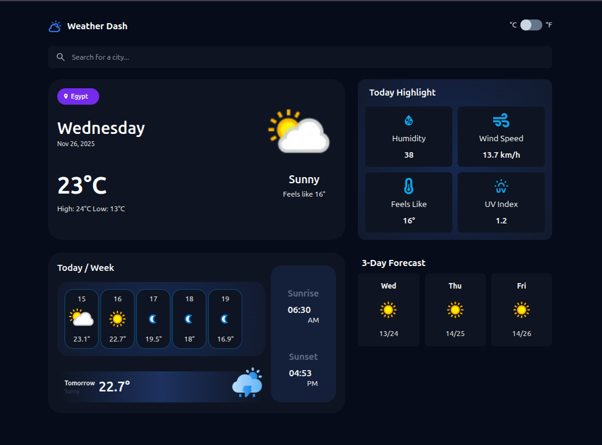

# Taqs Weather App

A modern, responsive weather application built with React that provides real-time weather information and 5-day forecasts for cities worldwide.



## Features

- **Real-time Weather Data**: Get current weather conditions including temperature, humidity, wind speed, and UV index
- **5-Day Forecast**: View detailed weather predictions for the next 5 days
- **Location Detection**: Automatically detects your location on first load
- **City Search**: Search for any city worldwide with autocomplete suggestions
- **Temperature Units**: Toggle between Celsius and Fahrenheit
- **Responsive Design**: Fully optimized for mobile, tablet, and desktop devices
- **Modern UI**: Clean, gradient-based design with custom Tailwind CSS styling

## Tech Stack

- **Frontend Framework**: React 19.2.0
- **Styling**: Tailwind CSS 3.4.18
- **HTTP Client**: Axios 1.12.2
- **Icons**: React Icons 5.5.0
- **Testing**: React Testing Library
- **API**: WeatherAPI.com & GeoDB Cities API

## Getting Started

### Prerequisites

- Node.js (v14 or higher)
- npm or yarn

### Installation

1. Clone the repository:
```bash
git clone <https://github.com/AbdalrahmanEmara/Taqs>
cd Taqs
```

2. Install dependencies:
```bash
npm install
```

3. Start the development server:
```bash
npm start
```

The app will open at [http://localhost:3000](http://localhost:3000)

## Available Scripts

- **`npm start`**: Runs the app in development mode
- **`npm test`**: Launches the test runner in interactive watch mode
- **`npm run build`**: Builds the app for production to the `build` folder
- **`npm run eject`**: Ejects from Create React App (one-way operation)

## Project Structure

```
Taqs/
├── public/              # Static files
│   ├── index.html      # HTML template
│   └── favicon.ico     # App icon
├── src/
│   ├── components/     # React components
│   │   ├── App.js                  # Root component
│   │   ├── Header.js               # App header
│   │   ├── Search.js               # City search with autocomplete
│   │   ├── SearchSuggestions.js    # Search dropdown
│   │   ├── WeatherDetails.js       # Main weather display
│   │   ├── TodayWeather.js         # Current weather card
│   │   ├── Forecast.js             # 5-day forecast container
│   │   ├── ComingDay.js            # Individual forecast day
│   │   ├── HighlightCards.js       # Weather highlights grid
│   │   ├── HighlightCard.js        # Individual highlight card
│   │   ├── MoreDayInfo.js          # Additional day information
│   │   ├── HourlyWeather.js        # Hourly forecast
│   │   ├── SunriseSunset.js        # Sunrise/sunset times
│   │   ├── Spinner.js              # Loading indicator
│   │   └── Error.js                # Error display
│   ├── context/
│   │   └── weatherContext.jsx      # Global weather state management
│   ├── index.css       # Global styles
│   └── index.js        # App entry point
├── tailwind.config.js  # Tailwind CSS configuration
└── package.json        # Project dependencies
```

## Architecture

### State Management

The app uses React Context API with `useReducer` for global state management:

- **weatherContext.jsx**: Manages weather data, loading states, errors, coordinates, and temperature units
- **Reducer Actions**:
  - `readyToFetch`: Prepares for data fetching
  - `loadingCoords`: Sets coordinates and loading state
  - `weather/loaded`: Updates weather data after successful fetch
  - `changeTempType`: Toggles between Celsius and Fahrenheit
  - `error`: Handles error states

### Key Features Implementation

#### Geolocation
- Automatically requests user location on app load
- Falls back to manual city search if location access is denied

#### Debounced Search
- Uses lodash debounce (500ms delay) to optimize API calls
- Fetches city suggestions from GeoDB Cities API
- Removes duplicate city entries

#### Weather Data Flow
1. User grants location permission or searches for a city
2. Coordinates are dispatched to weather context
3. WeatherAPI.com is called with coordinates
4. Weather data is processed and stored in context
5. Components subscribe to context and display data

### Custom Tailwind Configuration

- **Custom Colors**: Primary blue, background light/dark variants
- **Custom Fonts**: Inter and Noto Sans
- **Custom Breakpoints**: `miniMob` (400px), `mob` (530px), `tablet` (800px)
- **Gradient Utilities**: Radial and linear gradient helpers

## API Configuration

The app uses two APIs:

1. **WeatherAPI.com** - For weather data and forecasts
2. **GeoDB Cities API** - For city search and autocomplete

> **Note**: API keys are currently hardcoded in `Search.js`. For production, move these to environment variables.

## Browser Support

- Chrome (latest)
- Firefox (latest)
- Safari (latest)
- Edge (latest)

## Contributing

1. Fork the repository
2. Create your feature branch (`git checkout -b feature/AmazingFeature`)
3. Commit your changes (`git commit -m 'Add some AmazingFeature'`)
4. Push to the branch (`git push origin feature/AmazingFeature`)
5. Open a Pull Request


## Acknowledgments

- Weather data provided by [WeatherAPI.com](https://www.weatherapi.com/)
- City data provided by [GeoDB Cities API](https://rapidapi.com/wirefreethought/api/geodb-cities)
- Icons from [React Icons](https://react-icons.github.io/react-icons/)
